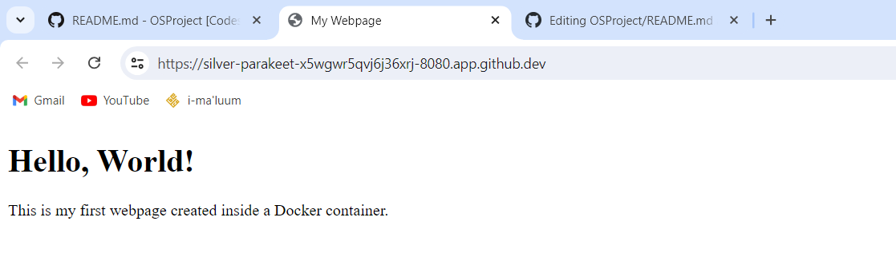

# OSProject Running Containers for Application Development

Group Name: __Fedora__. 

Section: 2

Team Mates:
1. Mayang Fauni binti Ahmad Suryadi  2216462
2. Nurhannan Gairuzazmi 2210472
3. Siti Nur Raihannah Binti Mohd Nazrul 2219358

## Rules
1. You are allowed to have **3 group** members. *Exception* is allowed **IFF (if and only if)** you are allowed to have 4 group members if you are a **multinational** or a **multigender** group. 
2. When you complete the project, make sure to submit the repository link of your cloned project. Make sure all the files are as what you aspect in your repository. 
3. Answer all questions in the **README.md**, in your own repository. Either use the online VSCode, terminal or github to edit. Answers are expected where you see __Fill answer here__.
4. Learn how to use markdown. https://www.w3schools.io/file/markdown-introduction/

## Forking this OS project repository
1. First thing you need in doing this project is to have a github account. Make sure to sign up at https://www.github.com
2. The second thing you need is to fork the OS project repository in your own github account. 

    1. Go to https://github.com/joeynor/OSProject and click fork to copy the project into your own repository
    2. Make sure that the new fork is now in your own repository

***Questions:***

1. What is the link of the fork OSProject in your repository. ***(1 mark)*** __Fill answer here_.
2. How many files and folders are in this repository. ***(1 mark)*** __Fill answer here__.


## Exploring github codespaces

1. The next thing that we will be doing is exploring codespaces. First of all, read about codespaces https://docs.github.com/en/codespaces/overview#what-is-a-codespace
2. Then go to the link https://github.com/codespaces and we shall start a new codespace.  
3. Click on ***New codespace***.
4. Choose your own OSProject repository to start your codespace.

 

5. Once you have created you codespace, you will see the following. You might already be familiar with this, since it will look similar to VSCode. 

 

6. You will see the [README file](./README.md) file. One is a preview of how it looks like on the web, and the other is the editing view in markdown language. 
7. Edit the [README file](./README.md). Make sure you have your group details correct, ie, group name, section and team members along with their matric IDs. 
8. Once you have finish editing, click File->Save or ***ctrl-s*** to save it. 
9. After saving, you will notice an M or U next to your file. You will need to commit any changes, whenever you make changes so that it is uploaded to the github repository. 

 

10. Click on the source control, hint: its on the left side panel, and it will list down the files that have been modified or updated. Click on commit. It will then ask you "Would you like to stage all your changes and commit them directly?" Just say yes, and a new tab will appear. Type a message to log what you have done, and click on the check mark. 

 

11. After that, sync the changes to the main repository. 
12. Make sure to commit and sync your files to the main repository, or else, your work will be lost since it is not saved into the main repository when you submit your project.

***Questions:***

1. What is default OS used to run the virtual environment for codespaces. ***(1 mark)*** 
```bash
linux
``` 

2. What are the two options of ram, disk and vcpu configuration you can have in running codespaces . ***(1 mark)*** 
```bash
RAM: 4GB, 8GB
Disk Space: Default is around 20GB; customize as needed.
vCPU: Options include 1 vCPU, 2 vCPUs
```

3. Why must we commit and sync our current work on source control? ***(1 mark)*** 
```bash
To make sure we can track changes and ensure no data loss after making changes.
```

## Exploring the Terminal

1. Look at the TERMINAL tab. Explore and run commands according to the questions below. 
2. You can include your answers as images, or cut and paste the output here. If you are cutting and pasting your answers, wrap your answers in the codeblock clause in markdown. For example, if i run the command **whoami** the the output would look like the one below.
```bash
@joeynor ➜ /workspaces/OSProject (main) $ whoami 
codespace
```


***Questions:***

Look at the TERMINAL tab. Run the following commands and provide the output here. 

1. Run the command **pwd** . ***(1 mark)*** 
```bash
@mayangAhmad ➜ /workspaces/OSProject (main) $ pwd
/workspaces/OSProject
```
2. Run the command **cat /etc/passwd** . ***(1 mark)***
```bash
@mayangAhmad ➜ /workspaces/OSProject (main) $ cat /etc/passwd
root:x:0:0:root:/root:/bin/bash
daemon:x:1:1:daemon:/usr/sbin:/usr/sbin/nologin
bin:x:2:2:bin:/bin:/usr/sbin/nologin
sys:x:3:3:sys:/dev:/usr/sbin/nologin
sync:x:4:65534:sync:/bin:/bin/sync
games:x:5:60:games:/usr/games:/usr/sbin/nologin
man:x:6:12:man:/var/cache/man:/usr/sbin/nologin
lp:x:7:7:lp:/var/spool/lpd:/usr/sbin/nologin
mail:x:8:8:mail:/var/mail:/usr/sbin/nologin
news:x:9:9:news:/var/spool/news:/usr/sbin/nologin
uucp:x:10:10:uucp:/var/spool/uucp:/usr/sbin/nologin
proxy:x:13:13:proxy:/bin:/usr/sbin/nologin
www-data:x:33:33:www-data:/var/www:/usr/sbin/nologin
backup:x:34:34:backup:/var/backups:/usr/sbin/nologin
list:x:38:38:Mailing List Manager:/var/list:/usr/sbin/nologin
irc:x:39:39:ircd:/var/run/ircd:/usr/sbin/nologin
gnats:x:41:41:Gnats Bug-Reporting System (admin):/var/lib/gnats:/usr/sbin/nologin
nobody:x:65534:65534:nobody:/nonexistent:/usr/sbin/nologin
_apt:x:100:65534::/nonexistent:/usr/sbin/nologin
systemd-timesync:x:101:101:systemd Time Synchronization,,,:/run/systemd:/usr/sbin/nologin
systemd-network:x:102:103:systemd Network Management,,,:/run/systemd:/usr/sbin/nologin
systemd-resolve:x:103:104:systemd Resolver,,,:/run/systemd:/usr/sbin/nologin
messagebus:x:104:105::/nonexistent:/usr/sbin/nologin
codespace:x:1000:1000::/home/codespace:/bin/bash
sshd:x:105:65534::/run/sshd:/usr/sbin/nologin
```
3. Run the command **df** . ***(1 mark)*** 
```bash
@mayangAhmad ➜ /workspaces/OSProject (main) $ df
Filesystem     1K-blocks     Used Available Use% Mounted on
overlay         32847680 10410120  20743464  34% /
tmpfs              65536        0     65536   0% /dev
shm                65536        0     65536   0% /dev/shm
/dev/root       30298176 22492400   7789392  75% /vscode
/dev/sda1       46127956      104  43752276   1% /tmp
/dev/loop3      32847680 10410120  20743464  34% /workspaces
```

4. Run the command **du** . ***(1 mark)***
```bash
1972    ./images
8       ./.git/logs/refs/heads
8       ./.git/logs/refs/remotes/origin
12      ./.git/logs/refs/remotes
24      ./.git/logs/refs
32      ./.git/logs
4       ./.git/lfs/tmp
8       ./.git/lfs
8       ./.git/info
68      ./.git/hooks
8       ./.git/objects/fd
8       ./.git/objects/a3
8       ./.git/objects/71
8       ./.git/objects/f6
8       ./.git/objects/fa
12      ./.git/objects/14
12      ./.git/objects/3d
12      ./.git/objects/29
12      ./.git/objects/6e
8       ./.git/objects/b9
8       ./.git/objects/4a
12      ./.git/objects/72
8       ./.git/objects/74
12      ./.git/objects/70
12      ./.git/objects/2e
12      ./.git/objects/17
8       ./.git/objects/d8
8       ./.git/objects/c0
4       ./.git/objects/info
12      ./.git/objects/e5
8       ./.git/objects/81
12      ./.git/objects/62
12      ./.git/objects/d2
8       ./.git/objects/e9
12      ./.git/objects/af
16      ./.git/objects/fb
8       ./.git/objects/f2
8       ./.git/objects/96
8       ./.git/objects/1b
8       ./.git/objects/0d
8       ./.git/objects/b6
8       ./.git/objects/3a
8       ./.git/objects/b2
12      ./.git/objects/ff
8       ./.git/objects/83
8       ./.git/objects/86
12      ./.git/objects/64
8       ./.git/objects/52
8       ./.git/objects/ab
8       ./.git/objects/93
8       ./.git/objects/a4
8       ./.git/objects/0b
12      ./.git/objects/73
8       ./.git/objects/c3
8       ./.git/objects/fe
8       ./.git/objects/4f
12      ./.git/objects/b5
8       ./.git/objects/58
8       ./.git/objects/cb
12      ./.git/objects/1c
12      ./.git/objects/44
8       ./.git/objects/fc
8       ./.git/objects/c6
8       ./.git/objects/7b
8       ./.git/objects/24
8       ./.git/objects/60
8       ./.git/objects/eb
8       ./.git/objects/91
8       ./.git/objects/49
8       ./.git/objects/3f
8       ./.git/objects/47
8       ./.git/objects/cd
1828    ./.git/objects/pack
8       ./.git/objects/20
8       ./.git/objects/a6
8       ./.git/objects/e7
8       ./.git/objects/41
8       ./.git/objects/4b
8       ./.git/objects/04
2452    ./.git/objects
8       ./.git/refs/heads
4       ./.git/refs/tags
8       ./.git/refs/remotes/origin
12      ./.git/refs/remotes
28      ./.git/refs
4       ./.git/branches
2628    ./.git
4624    .
```

5. Run the command **ls** . ***(1 mark)***
```bash
@mayangAhmad ➜ /workspaces/OSProject (main) $ ls
README.md  images
```

6. Run the command **ls -asl** . ***(1 mark)*** 
```bash
@mayangAhmad ➜ /workspaces/OSProject (main) $ ls -asl
total 40
 4 drwxrwxrwx+ 4 codespace root  4096 Jun 27 15:58 .
 4 drwxr-xrwx+ 5 codespace root  4096 Jun 27 15:58 ..
 4 drwxrwxrwx+ 9 codespace root  4096 Jun 27 15:59 .git
24 -rw-rw-rw-  1 codespace root 21619 Jun 28 08:33 README.md
 4 drwxrwxrwx+ 2 codespace root  4096 Jun 27 15:58 images
 ```

7. Run the command **free -h** . ***(1 mark)***
```bash
@mayangAhmad ➜ /workspaces/OSProject (main) $ free -h
              total        used        free      shared  buff/cache   available
Mem:          7.7Gi       1.4Gi       1.4Gi        63Mi       4.9Gi       6.0Gi
Swap:            0B          0B          0B
```

8. Run the command **cat /proc/cpuinfo** . ***(1 mark)*** 
```bash
@mayangAhmad ➜ /workspaces/OSProject (main) $ cat /proc/cpuinfo
processor       : 0
vendor_id       : AuthenticAMD
cpu family      : 25
model           : 1
model name      : AMD EPYC 7763 64-Core Processor
stepping        : 1
microcode       : 0xffffffff
cpu MHz         : 3123.320
cache size      : 512 KB
physical id     : 0
siblings        : 2
core id         : 0
cpu cores       : 1
apicid          : 0
initial apicid  : 0
fpu             : yes
fpu_exception   : yes
cpuid level     : 13
wp              : yes
flags           : fpu vme de pse tsc msr pae mce cx8 apic sep mtrr pge mca cmov pat pse36 clflush mmx fxsr sse sse2 ht syscall nx mmxext fxsr_opt pdpe1gb rdtscp lm constant_tsc rep_good nopl tsc_reliable nonstop_tsc cpuid extd_apicid aperfmperf pni pclmulqdq ssse3 fma cx16 pcid sse4_1 sse4_2 movbe popcnt aes xsave avx f16c rdrand hypervisor lahf_lm cmp_legacy svm cr8_legacy abm sse4a misalignsse 3dnowprefetch osvw topoext invpcid_single vmmcall fsgsbase bmi1 avx2 smep bmi2 erms invpcid rdseed adx smap clflushopt clwb sha_ni xsaveopt xsavec xgetbv1 xsaves clzero xsaveerptr rdpru arat npt nrip_save tsc_scale vmcb_clean flushbyasid decodeassists pausefilter pfthreshold v_vmsave_vmload umip vaes vpclmulqdq rdpid fsrm
bugs            : sysret_ss_attrs null_seg spectre_v1 spectre_v2 spec_store_bypass srso
bogomips        : 4890.86
TLB size        : 2560 4K pages
clflush size    : 64
cache_alignment : 64
address sizes   : 48 bits physical, 48 bits virtual
power management:

processor       : 1
vendor_id       : AuthenticAMD
cpu family      : 25
model           : 1
model name      : AMD EPYC 7763 64-Core Processor
stepping        : 1
microcode       : 0xffffffff
cpu MHz         : 3095.687
cache size      : 512 KB
physical id     : 0
siblings        : 2
core id         : 0
cpu cores       : 1
apicid          : 1
initial apicid  : 1
fpu             : yes
fpu_exception   : yes
cpuid level     : 13
wp              : yes
flags           : fpu vme de pse tsc msr pae mce cx8 apic sep mtrr pge mca cmov pat pse36 clflush mmx fxsr sse sse2 ht syscall nx mmxext fxsr_opt pdpe1gb rdtscp lm constant_tsc rep_good nopl tsc_reliable nonstop_tsc cpuid extd_apicid aperfmperf pni pclmulqdq ssse3 fma cx16 pcid sse4_1 sse4_2 movbe popcnt aes xsave avx f16c rdrand hypervisor lahf_lm cmp_legacy svm cr8_legacy abm sse4a misalignsse 3dnowprefetch osvw topoext invpcid_single vmmcall fsgsbase bmi1 avx2 smep bmi2 erms invpcid rdseed adx smap clflushopt clwb sha_ni xsaveopt xsavec xgetbv1 xsaves clzero xsaveerptr rdpru arat npt nrip_save tsc_scale vmcb_clean flushbyasid decodeassists pausefilter pfthreshold v_vmsave_vmload umip vaes vpclmulqdq rdpid fsrm
bugs            : sysret_ss_attrs null_seg spectre_v1 spectre_v2 spec_store_bypass srso
bogomips        : 4890.86
TLB size        : 2560 4K pages
clflush size    : 64
cache_alignment : 64
address sizes   : 48 bits physical, 48 bits virtual
power management:
```

9. Run the command **top** and type **q** to quit. ***(1 mark)*** 
```bash
processor       : 1
vendor_id       : AuthenticAMD
cpu family      : 25
model           : 1
model name      : AMD EPYC 7763 64-Core Processor
stepping        : 1
microcode       : 0xffffffff
cpu MHz         : 3095.687
cache size      : 512 KB
physical id     : 0
siblings        : 2
core id         : 0
cpu cores       : 1
apicid          : 1
initial apicid  : 1
fpu             : yes
fpu_exception   : yes
cpuid level     : 13
top - 08:39:30 up 17 min,  0 users,  load average: 0.33, 0.31, 0.41
Tasks:  20 total,   1 running,  19 sleeping,   0 stopped,   0 zombie
%Cpu(s):  2.4 us,  2.7 sy,  0.0 ni, 94.8 id,  0.2 wa,  0.0 hi,  0.0 si,  0.0 st
MiB Mem :   7929.6 total,   1406.9 free,   1462.4 used,   5060.2 buff/cache
MiB Swap:      0.0 total,      0.0 free,      0.0 used.   6087.9 avail Mem 

    PID USER      PR  NI    VIRT    RES    SHR S  %CPU  %MEM     TIME+ COMMAND                                                                                                 
    607 codespa+  20   0   21.5g 369528  49920 S   0.7   4.6   0:24.56 node                                                                                                    
   1640 root      20   0 1725100  42180  30336 S   0.3   0.5   0:00.24 containerd                                                                                              
      1 codespa+  20   0    1136    640    640 S   0.0   0.0   0:00.04 docker-init                                                                                             
      7 codespa+  20   0    7236   1664   1664 S   0.0   0.0   0:00.01 sleep                                                                                                   
     22 root      20   0   12196   3352   2432 S   0.0   0.0   0:00.00 sshd                                                                                                    
    359 codespa+  20   0    2616   1408   1408 S   0.0   0.0   0:00.00 sh                                                                                                      
    375 root      20   0    2616   1408   1408 S   0.0   0.0   0:00.00 sh                                                                                                      
    577 codespa+  20   0    2624   1664   1664 S   0.0   0.0   0:00.00 sh                                                                                                      
    586 codespa+  20   0 1317168  91116  45184 S   0.0   1.1   0:04.32 node 
```

10. Run the command **uname -a**. ***(1 mark)*** 
```bash
@mayangAhmad ➜ /workspaces/OSProject (main) $ uname -a
Linux codespaces-e57236 6.5.0-1022-azure #23~22.04.1-Ubuntu SMP Thu May  9 17:59:24 UTC 2024 x86_64 x86_64 x86_64 GNU/Linux
```

11. What is the available free memory in the system. ***(1 mark)*** 
```bash
1406.9 MiB
```

12. What is the available disk space mounted on /workspace. ***(1 mark)*** 
```bash
@mayangAhmad ➜ /workspaces/OSProject (main) $ df -h /workspaces/OSProject
Filesystem      Size  Used Avail Use% Mounted on
/dev/loop3       32G   10G   20G  34% /workspaces

available disk space mounted is 20GB
```

13. Name the version and hardware architecture of the linux Virtual environment. ***(1 mark)*** 
```bash
hardware architecture: x86_64
linux version: 23~22.04.1-Ubuntu
```

14. What is the difference between **ls** vs **ls -asl**. ***(1 mark)*** 
ls command lists files and directories within the current working directory. By default, it displays a simple list of file names in alphabetical order.
ls -asl command provides a long listing format. It includes additional details such as file permissions, owner, group, size, and modification date.


15. What is the TLB size of the Virtual CPU. ***(1 mark)*** 
```bash
2560 4K pages
```

16. What is the CPU speed of the Virtual CPU. ***(1 mark)*** 
```bash
3244.033 MHz
```

17. What is the top running process that consumes the most CPU cycles. ***(1 mark)*** 
```bash
PID 607 codespa+node
```

## Running your own container instance.

1. At the terminal, run a linux instance. By typing the following command. 
```
docker pull debian
docker run --detach -it debian
```
2. This will run the debian container. To check if the debian container is running, type
```bash
@joeynor ➜ /workspaces/OSProject (main) $ docker ps -a
CONTAINER ID   IMAGE     COMMAND   CREATED         STATUS         PORTS     NAMES
f65be1987f84   debian    "bash"    4 minutes ago   Up 4 minutes             romantic_jackson
```

3. Keep note of the name used by your container, this is usually given random names unless you specify your own name. Now run a bash command on the container. Make sure you use the name of your container instead of the one shown here. 
```bash
docker exec -i -t romantic_jackson /bin/bash
```

4. Create a file on the container. First you must make sure you are in the bash command prompt of the container. The container is new, and does not have any software other than the debian OS. To create a new file, you will need an editor installed. In the bash shell of the container, run the package manager apt-get to install nano text editor. 

```bash
root@f65be1987f84:~# apt-get update      

root@f65be1987f84:~# apt-get install nano

root@f65be1987f84:~# cd /root

root@f65be1987f84:~# nano helloworld.txt
```

5. Edit your helloworld.txt, create your messsage and save by typing ctrl-X. Once saved, explore using the container to see where the file is located. Then exit the shell, by typing **exit**.

6. Stop the container and run **docker ps -a**, and restart the container again. Is your file in the container still available?
yes
```bash 
@joeynor ➜ /workspaces/OSProject (main) $ docker stop romantic_jackson

@joeynor ➜ /workspaces/OSProject (main) $ docker ps -a
CONTAINER ID   IMAGE     COMMAND   CREATED          STATUS                        PORTS     NAMES
f65be1987f84   debian    "bash"    19 minutes ago   Exited (137) 18 seconds ago             romantic_jackson

@joeynor ➜ /workspaces/OSProject (main) $ docker restart romantic_jackson
```

```bash 
@hannangrzm ➜ /workspaces/OSProject/myroot/webpage (main) $ docker stop pedantic_wescoff
pedantic_wescoff
@hannangrzm ➜ /workspaces/OSProject/myroot/webpage (main) $ docker ps -a
CONTAINER ID   IMAGE     COMMAND              CREATED        STATUS                        PORTS                                   NAMES
c9312e4d6e92   httpd     "httpd-foreground"   16 hours ago   Up 4 minutes                  0.0.0.0:8080->80/tcp, :::8080->80/tcp   quizzical_heisenberg
90ca764d0917   debian    "bash"               16 hours ago   Exited (255) 10 minutes ago                                           pedantic_wescoff
@hannangrzm ➜ /workspaces/OSProject/myroot/webpage (main) $ docker restart pedantic_wescoff
pedantic_wescoff
@hannangrzm ➜ /workspaces/OSProject/myroot/webpage (main) $ docker ps -a 
CONTAINER ID   IMAGE     COMMAND              CREATED        STATUS         PORTS                                   NAMES
c9312e4d6e92   httpd     "httpd-foreground"   16 hours ago   Up 5 minutes   0.0.0.0:8080->80/tcp, :::8080->80/tcp   quizzical_heisenberg
90ca764d0917   debian    "bash"               16 hours ago   Up 4 seconds                                           pedantic_wescoff
```

7. Stop the container and delete the container. What happened to your helloworld.txt?  dissapeared

```bash 
@joeynor ➜ /workspaces/OSProject (main) $ docker stop romantic_jackson

@joeynor ➜ /workspaces/OSProject (main) $ docker ps -a
CONTAINER ID   IMAGE     COMMAND   CREATED          STATUS                        PORTS     NAMES
f65be1987f84   debian    "bash"    19 minutes ago   Exited (137) 18 seconds ago             romantic_jackson

@joeynor ➜ /workspaces/OSProject (main) $ docker rm romantic_jackson
```
```bash 
@hannangrzm ➜ /workspaces/OSProject/myroot/webpage (main) $ docker stop pedantic_wescoff
pedantic_wescoff
@hannangrzm ➜ /workspaces/OSProject/myroot/webpage (main) $ docker rm pedantic wesscoff
Error response from daemon: No such container: pedantic
Error response from daemon: No such container: wesscoff
@hannangrzm ➜ /workspaces/OSProject/myroot/webpage (main) $ docker rm pedantic_wesscoff
Error response from daemon: No such container: pedantic_wesscoff
@hannangrzm ➜ /workspaces/OSProject/myroot/webpage (main) $ docker rm pedantic_wescoff
pedantic_wescoff
@hannangrzm ➜ /workspaces/OSProject/myroot/webpage (main) $ docker ps -a 
CONTAINER ID   IMAGE     COMMAND              CREATED        STATUS         PORTS                                   NAMES
c9312e4d6e92   httpd     "httpd-foreground"   16 hours ago   Up 8 minutes   0.0.0.0:8080->80/tcp, :::8080->80/tcp   quizzical_heisenberg
```

***Questions:***

1. Are files in the container persistent. Why not?. ***(1 mark)*** no because filesystem is wiped when the container is removed
2. Can we run two, or three instances of debian linux? . ***(1 mark)*** yes

## Running your own container with persistent storage

1. In the previous experiment, you might have notice that containers are not persistent. To make storage persistent, you will need to mount them. 
At the terminal, create a new directory called **myroot**, and run a instance of debian linux and mount myroot to the container. Find out the exact path of my root, and mount it as the root folder in the debian container. 
2. Create a file in /root on the container, the files should also appear in myroot of your host VM.

```bash 
@joeynor ➜ /workspaces/OSProject (main) $ mkdir myroot
@joeynor ➜ /workspaces/OSProject (main) $ cd myroot/
@joeynor ➜ /workspaces/OSProject/myroot (main) $ pwd
/workspaces/OSProject/myroot

@joeynor ➜ /workspaces/OSProject/myroot (main) $ docker run --detach -it -v /workspaces/OSProject/myroot:/root debian
```

***Questions:***

1. Check the permission of the files created in myroot, what user and group is the files created in docker container on the host virtual machine? . ***(2 mark)*** 
```bash
-rw-rw-rw- 1 root root 0 Jun 28 16:11 helloworld.txt
The files created in the Docker container (helloworld.txt) on the host virtual machine (/workspaces/OSProject/myroot) are owned by the root user and belong to the root group.
```

2. Can you change the permission of the files to user codespace.  You will need this to be able to commit and get points for this question. yes
```bash
//use sudo and chown
sudo chown -R codespace:codespace myroot

```

```bash
@hannangrzm ➜ /workspaces/OSProject/myroot (main) $ ls -l /workspaces/OSProject/myroot
total 0
-rw-rw-rw- 1 codespace codespace 0 Jun 28 16:11 helloworld.txt
``` 

## You are on your own, create your own static webpage

1. Create a directory called webpage in your host machine
2. Inside the directory, create a page index.html, with any content you would like
3. Then, run the apache webserver and mount the webpage directory to it. Hint:
```bash
## the -p 8080:80 flag points the host port 8080 to the container port 80

docker run --detach -v /workspaces/OSProject/webpage:/usr/local/apache2/htdocs/ -p 8080:80 httpd
```

4. If it works, codespace will trigger a port assignment and provide a URL for you to access your webpage like the one below.

 


5. You can also see the Port in the **PORTS** tab, next to the terminal tab.

6. You can then access your website by adding an index.html towards the end of your url link, like the one below. 

 



***Questions:***

1. What is the permission of folder /usr/local/apache/htdocs and what user and group owns the folder? . ***(2 mark)***
   Permissions of /usr/local/apache2/htdocs: drwxr-xr-x
   Owner and group of /usr/local/apache2/htdocs: User ID 1000, Group ID 1000
3. What port is the apache web server running. ***(1 mark)*** 8080
4. What port is open for http protocol on the host machine? ***(1 mark)*** 80

## Create SUB Networks

1. In docker, you can create your own private networks where you can run multiple services, in this part, we will create two networks, one called bluenet and the other is rednet
2. Run the docker create network to create you networks like the ones below
```bash
## STEP 1:
## Create Networks ##
docker network create bluenet
docker network create rednet`

## STEP 2: (automatically running)
## Create (1) Container in background called "c1" running busybox image ##
docker run -itd --net bluenet --name c1 busybox sh
docker run -itd --net rednet --name c2 busybox sh
```
***Questions:***

1. Describe what is busybox and what is command switch **--name** is for? . BusyBox is a software suite that provides several Unix utilities in a single executable file. It is often used in embedded systems and Docker containers because it offers a lightweight set of tools that are efficient and functional. --name switch: The --name switch in Docker is used to assign a name to a container. This makes it easier to reference the container by name rather than by its container ID, simplifying management and identification of the container***(2 mark)*** __Fill answer here__.
2. Explore the network using the command ```docker network ls```, show the output of your terminal. ***(1 mark)*** __Fill answer here__.

```
NETWORK ID     NAME      DRIVER    SCOPE
7c9a2668b993   bluenet   bridge    local
afe6dade3149   bridge    bridge    local
adaf77f09c85   host      host      local
acd86aee4060   none      null      local
413579fdbb0f   rednet    bridge    local

```
3. Using ```docker inspect c1``` and ```docker inspect c2``` inscpect the two network. What is the gateway of bluenet and rednet.?

```
luenet : 172.18.0.1
rednet : 172.19.0.1

```
***(1 mark)*** __Fill answer here__. 
4. What is the network address for the running container c1 and c2? 
```
IP address c1: 172.18.0.2
IP address c2: 172.19.0.2
```
***(1 mark)*** __Fill answer here__.
5. Using the command ```docker exec c1 ping c2```, which basically tries to do a ping from container c1 to c2. Are you able to ping? Show your output . 
```
No , Since c1 and c2 are on different networks (bluenet and rednet respectively), they cannot communicate directly with each other. Therefore, the ping command fails with a "bad address" error.
```
***(1 mark)*** __Fill answer here__.

## Bridging two SUB Networks
1. Let's try this again by creating a network to bridge the two containers in the two subnetworks
```
docker network create bridgenet
docker network connect bridgenet c1
docker network connect bridgenet c2
docker exec c1 ping c2
```
***Questions:***

1. Are you able to ping? Show your output .

 ```
 @raihannahnazrul ➜ /workspaces/OSProject (main) $ docker exec c1 ping c2
PING c2 (172.20.0.3): 56 data bytes
64 bytes from 172.20.0.3: seq=0 ttl=64 time=0.134 ms
64 bytes from 172.20.0.3: seq=1 ttl=64 time=0.086 ms
64 bytes from 172.20.0.3: seq=2 ttl=64 time=0.087 ms
64 bytes from 172.20.0.3: seq=3 ttl=64 time=0.062 ms
64 bytes from 172.20.0.3: seq=4 ttl=64 time=0.097 ms
64 bytes from 172.20.0.3: seq=5 ttl=64 time=0.077 ms
64 bytes from 172.20.0.3: seq=6 ttl=64 time=0.080 ms
64 bytes from 172.20.0.3: seq=7 ttl=64 time=0.071 ms
64 bytes from 172.20.0.3: seq=8 ttl=64 time=0.080 ms
64 bytes from 172.20.0.3: seq=9 ttl=64 time=0.086 ms
64 bytes from 172.20.0.3: seq=10 ttl=64 time=0.079 ms
64 bytes from 172.20.0.3: seq=11 ttl=64 time=0.064 ms
64 bytes from 172.20.0.3: seq=12 ttl=64 time=0.103 ms
64 bytes from 172.20.0.3: seq=13 ttl=64 time=0.067 ms
64 bytes from 172.20.0.3: seq=14 ttl=64 time=0.089 ms
64 bytes from 172.20.0.3: seq=15 ttl=64 time=0.080 ms
64 bytes from 172.20.0.3: seq=16 ttl=64 time=0.079 ms
64 bytes from 172.20.0.3: seq=17 ttl=64 time=0.079 ms
64 bytes from 172.20.0.3: seq=18 ttl=64 time=0.059 ms
64 bytes from 172.20.0.3: seq=19 ttl=64 time=0.087 ms
64 bytes from 172.20.0.3: seq=20 ttl=64 time=0.093 ms
64 bytes from 172.20.0.3: seq=21 ttl=64 time=0.081 ms
64 bytes from 172.20.0.3: seq=22 ttl=64 time=0.102 ms
64 bytes from 172.20.0.3: seq=23 ttl=64 time=0.075 ms
64 bytes from 172.20.0.3: seq=24 ttl=64 time=0.108 ms
64 bytes from 172.20.0.3: seq=25 ttl=64 time=0.086 ms
64 bytes from 172.20.0.3: seq=26 ttl=64 time=0.106 ms
64 bytes from 172.20.0.3: seq=27 ttl=64 time=0.087 ms
64 bytes from 172.20.0.3: seq=28 ttl=64 time=0.130 ms
64 bytes from 172.20.0.3: seq=29 ttl=64 time=0.070 ms
64 bytes from 172.20.0.3: seq=30 ttl=64 time=0.126 ms
64 bytes from 172.20.0.3: seq=31 ttl=64 time=0.082 ms
64 bytes from 172.20.0.3: seq=32 ttl=64 time=0.104 ms
64 bytes from 172.20.0.3: seq=33 ttl=64 time=0.073 ms
64 bytes from 172.20.0.3: seq=34 ttl=64 time=0.094 ms
64 bytes from 172.20.0.3: seq=35 ttl=64 time=0.074 ms
64 bytes from 172.20.0.3: seq=36 ttl=64 time=0.078 ms
64 bytes from 172.20.0.3: seq=37 ttl=64 time=0.077 ms
64 bytes from 172.20.0.3: seq=38 ttl=64 time=0.077 ms
64 bytes from 172.20.0.3: seq=39 ttl=64 time=0.090 ms
64 bytes from 172.20.0.3: seq=40 ttl=64 time=0.093 ms
64 bytes from 172.20.0.3: seq=41 ttl=64 time=0.078 ms
64 bytes from 172.20.0.3: seq=42 ttl=64 time=0.096 ms
64 bytes from 172.20.0.3: seq=43 ttl=64 time=0.079 ms
64 bytes from 172.20.0.3: seq=44 ttl=64 time=0.095 ms
64 bytes from 172.20.0.3: seq=45 ttl=64 time=0.070 ms
64 bytes from 172.20.0.3: seq=46 ttl=64 time=0.099 ms
64 bytes from 172.20.0.3: seq=47 ttl=64 time=0.082 ms
64 bytes from 172.20.0.3: seq=48 ttl=64 time=0.092 ms
64 bytes from 172.20.0.3: seq=49 ttl=64 time=0.084 ms
64 bytes from 172.20.0.3: seq=50 ttl=64 time=0.107 ms
64 bytes from 172.20.0.3: seq=51 ttl=64 time=0.084 ms
64 bytes from 172.20.0.3: seq=52 ttl=64 time=0.106 ms
64 bytes from 172.20.0.3: seq=53 ttl=64 time=0.071 ms
64 bytes from 172.20.0.3: seq=54 ttl=64 time=0.091 ms
64 bytes from 172.20.0.3: seq=55 ttl=64 time=0.084 ms
64 bytes from 172.20.0.3: seq=56 ttl=64 time=0.102 ms
64 bytes from 172.20.0.3: seq=57 ttl=64 time=0.082 ms
64 bytes from 172.20.0.3: seq=58 ttl=64 time=0.078 ms
64 bytes from 172.20.0.3: seq=59 ttl=64 time=0.084 ms
64 bytes from 172.20.0.3: seq=60 ttl=64 time=0.105 ms
64 bytes from 172.20.0.3: seq=61 ttl=64 time=0.117 ms
64 bytes from 172.20.0.3: seq=62 ttl=64 time=0.088 ms
64 bytes from 172.20.0.3: seq=63 ttl=64 time=0.072 ms
64 bytes from 172.20.0.3: seq=64 ttl=64 time=0.104 ms
64 bytes from 172.20.0.3: seq=65 ttl=64 time=0.075 ms
64 bytes from 172.20.0.3: seq=66 ttl=64 time=0.078 ms
64 bytes from 172.20.0.3: seq=67 ttl=64 time=0.084 ms
64 bytes from 172.20.0.3: seq=68 ttl=64 time=0.093 ms
64 bytes from 172.20.0.3: seq=69 ttl=64 time=0.089 ms
64 bytes from 172.20.0.3: seq=70 ttl=64 time=0.094 ms
64 bytes from 172.20.0.3: seq=71 ttl=64 time=0.084 ms
64 bytes from 172.20.0.3: seq=72 ttl=64 time=0.102 ms
64 bytes from 172.20.0.3: seq=73 ttl=64 time=0.071 ms
64 bytes from 172.20.0.3: seq=74 ttl=64 time=0.103 ms
64 bytes from 172.20.0.3: seq=75 ttl=64 time=0.081 ms
64 bytes from 172.20.0.3: seq=76 ttl=64 time=0.109 ms
64 bytes from 172.20.0.3: seq=77 ttl=64 time=0.085 ms
64 bytes from 172.20.0.3: seq=78 ttl=64 time=0.091 ms
64 bytes from 172.20.0.3: seq=79 ttl=64 time=0.087 ms
64 bytes from 172.20.0.3: seq=80 ttl=64 time=0.069 ms
64 bytes from 172.20.0.3: seq=81 ttl=64 time=0.076 ms
64 bytes from 172.20.0.3: seq=82 ttl=64 time=0.087 ms
64 bytes from 172.20.0.3: seq=83 ttl=64 time=0.066 ms
64 bytes from 172.20.0.3: seq=84 ttl=64 time=0.106 ms
64 bytes from 172.20.0.3: seq=85 ttl=64 time=0.078 ms
64 bytes from 172.20.0.3: seq=86 ttl=64 time=0.085 ms
64 bytes from 172.20.0.3: seq=87 ttl=64 time=0.080 ms
64 bytes from 172.20.0.3: seq=88 ttl=64 time=0.070 ms
64 bytes from 172.20.0.3: seq=89 ttl=64 time=0.102 ms
64 bytes from 172.20.0.3: seq=90 ttl=64 time=0.081 ms
64 bytes from 172.20.0.3: seq=91 ttl=64 time=0.079 ms
64 bytes from 172.20.0.3: seq=92 ttl=64 time=0.111 ms
64 bytes from 172.20.0.3: seq=93 ttl=64 time=0.117 ms
64 bytes from 172.20.0.3: seq=94 ttl=64 time=0.111 ms
64 bytes from 172.20.0.3: seq=95 ttl=64 time=0.078 ms
64 bytes from 172.20.0.3: seq=96 ttl=64 time=0.114 ms
64 bytes from 172.20.0.3: seq=97 ttl=64 time=0.085 ms
64 bytes from 172.20.0.3: seq=98 ttl=64 time=0.083 ms
64 bytes from 172.20.0.3: seq=99 ttl=64 time=0.087 ms
64 bytes from 172.20.0.3: seq=100 ttl=64 time=0.105 ms
64 bytes from 172.20.0.3: seq=101 ttl=64 time=0.071 ms
64 bytes from 172.20.0.3: seq=102 ttl=64 time=0.100 ms
64 bytes from 172.20.0.3: seq=103 ttl=64 time=0.086 ms
64 bytes from 172.20.0.3: seq=104 ttl=64 time=0.090 ms
64 bytes from 172.20.0.3: seq=105 ttl=64 time=0.080 ms
64 bytes from 172.20.0.3: seq=106 ttl=64 time=0.086 ms
64 bytes from 172.20.0.3: seq=107 ttl=64 time=0.090 ms
64 bytes from 172.20.0.3: seq=108 ttl=64 time=0.066 ms
64 bytes from 172.20.0.3: seq=109 ttl=64 time=0.083 ms
64 bytes from 172.20.0.3: seq=110 ttl=64 time=0.121 ms
64 bytes from 172.20.0.3: seq=111 ttl=64 time=0.083 ms
64 bytes from 172.20.0.3: seq=112 ttl=64 time=0.101 ms
64 bytes from 172.20.0.3: seq=113 ttl=64 time=0.084 ms
64 bytes from 172.20.0.3: seq=114 ttl=64 time=0.077 ms
64 bytes from 172.20.0.3: seq=115 ttl=64 time=0.073 ms
64 bytes from 172.20.0.3: seq=116 ttl=64 time=0.111 ms
64 bytes from 172.20.0.3: seq=117 ttl=64 time=0.068 ms
64 bytes from 172.20.0.3: seq=118 ttl=64 time=0.079 ms
 ```

Successfully ping c1 and c2. 
Previous Ping: The previous ping attempt failed with the error ping: bad address 'c2' because c1 and c2 were on separate, isolated networks (bluenet and rednet) and couldn't communicate with each other directly.
Current Ping: After connecting both containers to the bridgenet network, they are now part of a common network, allowing them to communicate with each other. As a result, the ping from c1 to c2 is successful.
 
 
 ***(1 mark)*** __Fill answer here__.
5. What is different from the previous ping in the section above? ***(1 mark)*** __Fill answer here__.

## Intermediate Level (10 marks bonus)

### Node.js and MySQL in Docker Containers

This guide will help you set up a simple Node.js website that retrieves a random row from a MySQL database. Both the MySQL server and the Node.js server will run in separate Docker containers on two separate networks. Your job is to make it work by making the two containers in two separate network bridged together.

#### Step 1: Set Up the Docker Network

Create a Docker network to for the two containers.
For mysql, call it **mysqlnet** for nodejs call it **nodejsnet** .

#### Step 2: Set Up the MySQL Container

Run a MySQL container on the created network.

```sh
docker run --name mysql-container --network mysqlnet -e MYSQL_ROOT_PASSWORD=rootpassword -e MYSQL_DATABASE=mydatabase -e MYSQL_USER=myuser -e MYSQL_PASSWORD=mypassword -d mysql:latest
```

#### Step 3: Set Up the Node.js Container

1. **Create a directory for your Node.js application and initialize it.**

    ```sh
    mkdir nodejs-app
    cd nodejs-app
    npm init -y
    npm install express mysql
    ```

2. **Create a file named `index.js` with the following content:**

    ```js
    const express = require('express');
    const mysql = require('mysql');

    const app = express();
    const port = 3000;

    // Create a MySQL connection
    const connection = mysql.createConnection({
      host: 'mysql-container',
      user: 'myuser',
      password: 'mypassword',
      database: 'mydatabase'
    });

    // Connect to MySQL
    connection.connect((err) => {
      if (err) {
        console.error('Error connecting to MySQL:', err);
        return;
      }
      console.log('Connected to MySQL');
    });

    // Define a route to get a random row
    app.get('/random', (req, res) => {
      const query = 'SELECT * FROM mytable ORDER BY RAND() LIMIT 1';
      connection.query(query, (err, results) => {
        if (err) {
          console.error('Error executing query:', err);
          res.status(500).send('Server Error');
          return;
        }
        res.json(results[0]);
      });
    });

    // Start the server
    app.listen(port, () => {
      console.log(`Server running at http://localhost:${port}`);
    });
    ```

3. **Create a Dockerfile for the Node.js application:**

    ```Dockerfile
    # Use the official Node.js image
    FROM node:14

    # Create and change to the app directory
    WORKDIR /usr/src/app

    # Copy application dependency manifests to the container image
    COPY package*.json ./

    # Install production dependencies
    RUN npm install

    # Copy local code to the container image
    COPY . .

    # Run the web service on container startup
    CMD [ "node", "index.js" ]
    ```

#### Step 4: Build and Run the Node.js Container

1. **Build the Docker image for the Node.js application.**

    ```sh
    docker build -t nodejs-app .
    ```

2. **Run the Node.js container on the same network as the MySQL container.**

    ```sh
    docker run --name nodejs-container --network nodejsnet -p 3000:3000 -d nodejs-app
    ```

#### Step 5: Test the Setup

You can now test the setup by accessing the Node.js application in your browser or using a tool like `curl`:

```sh
curl http://localhost:3000/random
```

#### Step 6: Ensure `mytable` is Populated

Make sure you have created the `mytable` table and populated it with some data in your MySQL database for the above steps to work correctly.

You can use the following SQL commands to create and populate the table (run these commands in the MySQL container):

```sql
CREATE TABLE mytable (
  id INT AUTO_INCREMENT PRIMARY KEY,
  name VARCHAR(255) NOT NULL,
  value VARCHAR(255) NOT NULL
);

INSERT INTO mytable (name, value) VALUES ('example1', 'value1'), ('example2', 'value2'), ('example3', 'value3');
```

### Summary

You have now set up a Node.js application in a Docker container on nodejsnet netowrk and a MySQL database in another Docker container on mysqlnet network. Now bridge the two network together.

***Questions:***

1. What is the output of step 5 above, explain the error? ***(1 mark)*** __Fill answer here__.
2. Show the instruction needed to make this work. ***(1 mark)*** __Fill answer here__.


## What to submit

1. Make sure to commit all changes on your source control, and make sure your source control is sync to the repository. 
2. Check your repository link, to see if all the files and answers are included in the repository. 
3. Submit through italeem, by providing the link to your repository.
4. Due by ***AS STATED IN ITALEEM SYSTEM***
